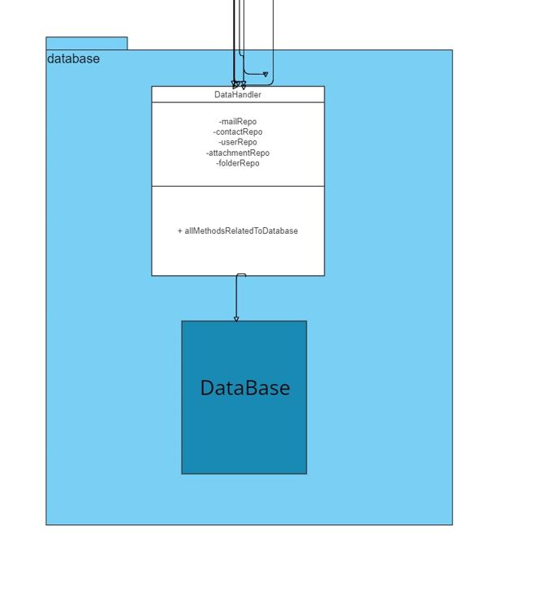
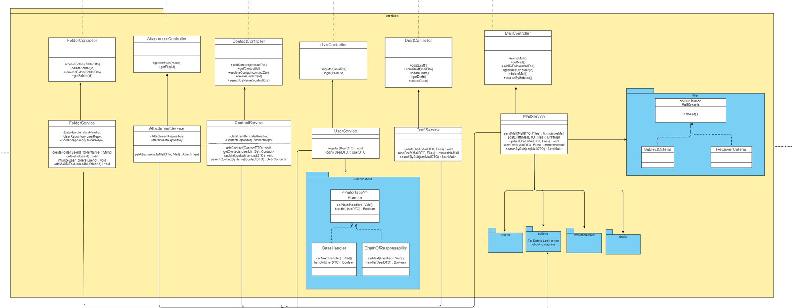
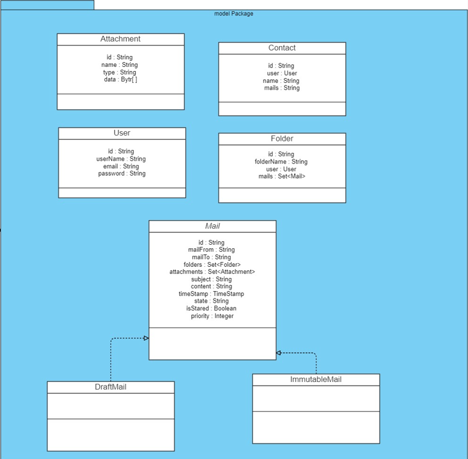
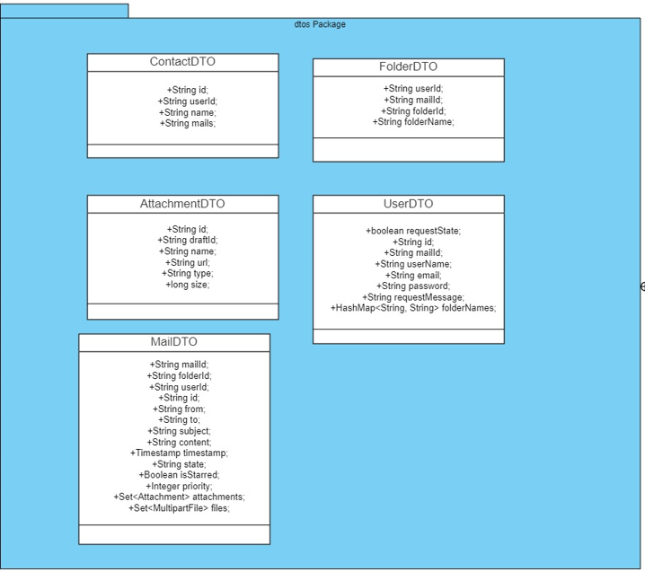
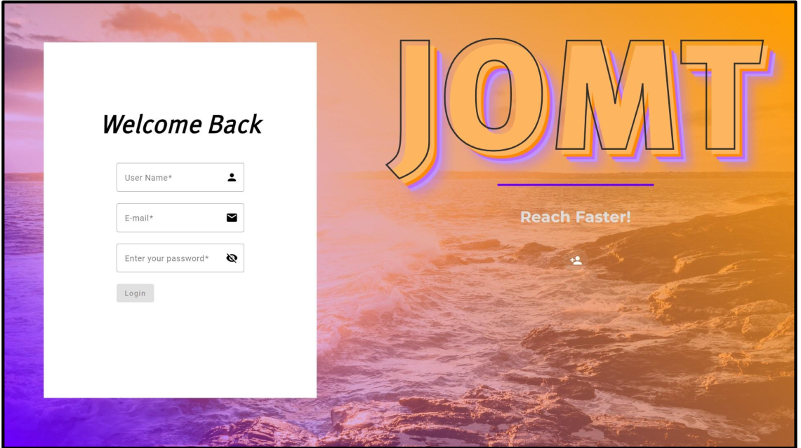
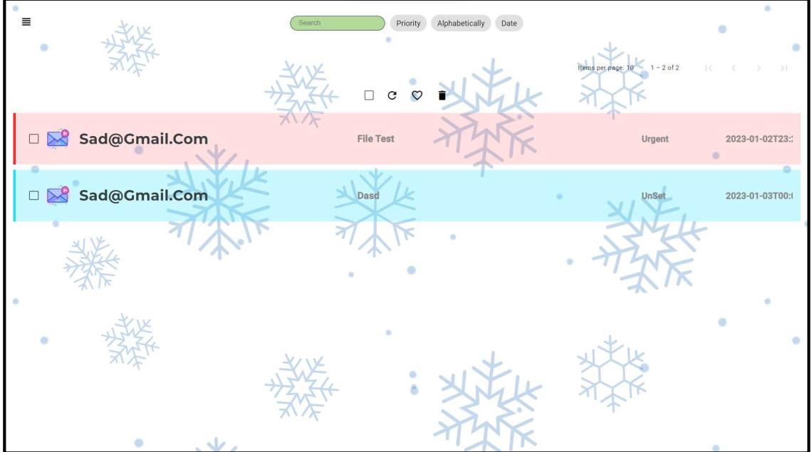
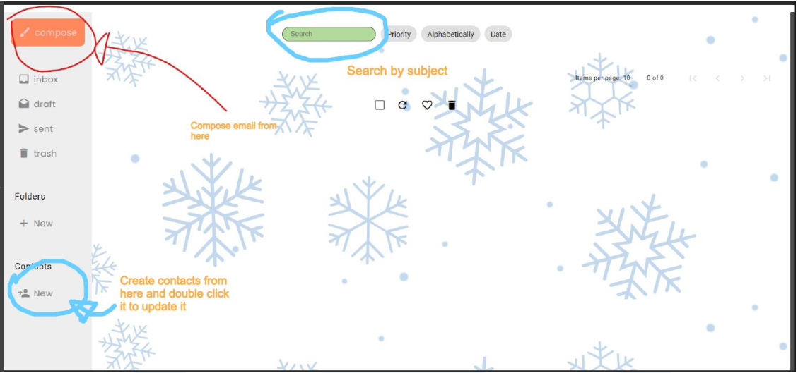
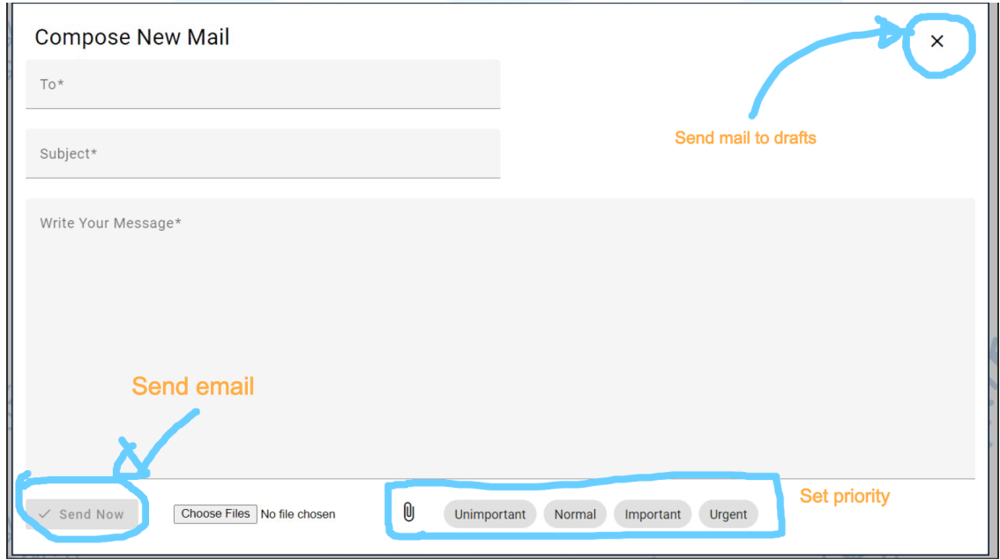

# JOMT_Mail
This project aims to develop a comprehensive web application that emulates the core functionalities of an email server, 
integrating aspects of mailbox management, attachments, contacts, and a user-friendly interface.      
This project focuses on implementing a robust mailing system using Java Spring Boot for the backend and Angular for the frontend.    
For the full report see embedded pdf file:
[Accursed Mail Server.pdf](https://github.com/OmarTammam25/JOMT_Mail/files/13208680/Accursed.Mail.Server.pdf)
## Class diagram:
Full UML class diagram: https://online.visual-paradigm.com/share.jsp?id=323233383633342d35#diagram:workspace=zkbbzfyt&proj=0&id=5

![image]assets/UML2.png)

## UI snippets

https://github.com/OmarTammam25/JOMT_Mail/assets/96181216/aee2c76d-020c-4453-bb8d-c21288b8da57

